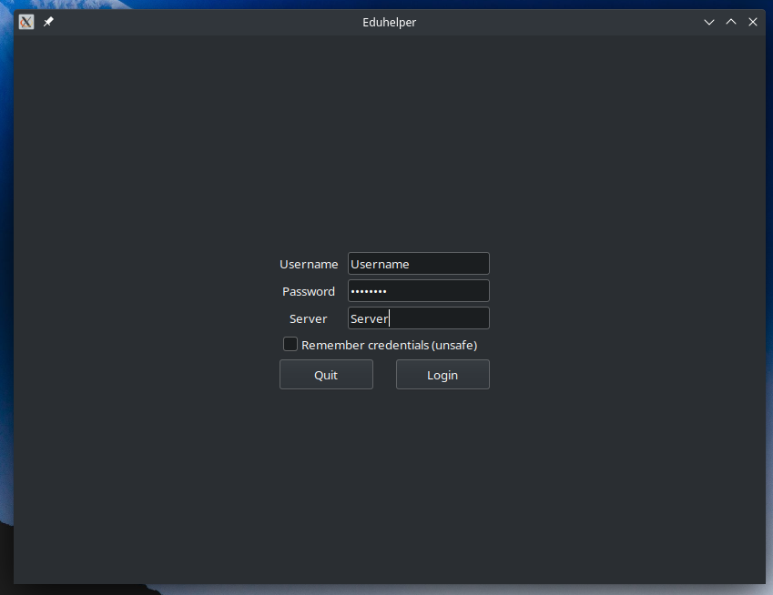
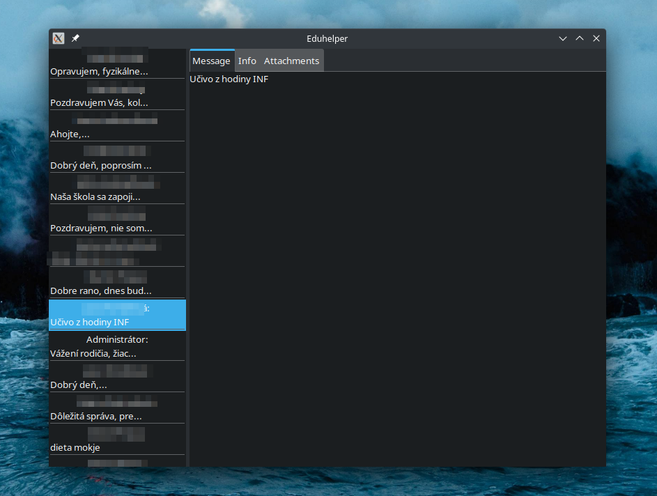
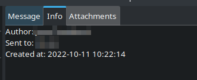
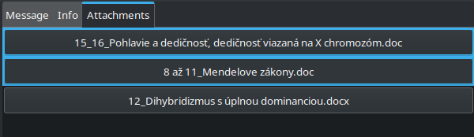

# Eduhelper - Edupage Client in GTK
  
GTK desktop application written in Go with [gogtk3](https://github.com/gotk3/gotk3).
Provides user interface, that interacts with the [Edupage](https://www.edupage.org/) School system. 

Tested on `Arch Linux x86_64 6.0.2-arch1-1` with `KDE Plasma` desktop environment.

I'll probably continue expanding this project.

### Support
Currently supported functions:
- Timeline messages (content, attachments)
- Homeworks (attachments)

### Screenshots

